<p align="center">
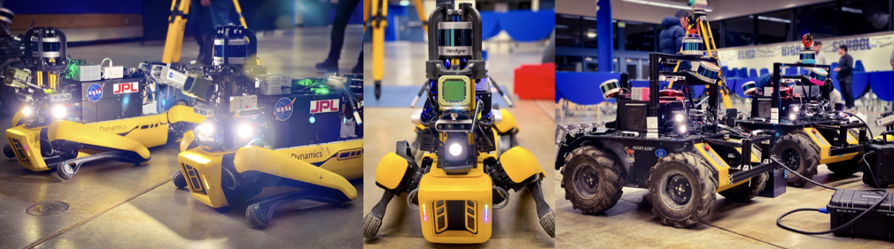
</p>

# Datasets

Here, you can download the datasets. 
- ```Rosbags``` - bag files to run
  - ```${robot_name}_lidar_*.bag``` - LiDAR scans (velodyne packets as well)
  - ```imu.bag``` - imu data from VN100 (covariance also included)
  - ```odometry.bag``` - different types of odometry data (wheeled, kinematic, visual)
- ```Extra files```:
  - ```odometry.bag``` - rosbag file that has a ground truth trajectory
  - ```*.ply```, ```*.pcd``` - 3D map provides information of the scanned 3D map
  - ```fiducial_calibration_${robot_name}$.yaml``` - provides information of inital position in the map (and from where the ground truth starts)
  - ```${robot_name}_sensors.yaml``` - stores information about relative transformation between frames and sensors
- ```2D image``` - provides information of the enviornment from bird's-eye-view

# LiDARs dataset
|  ID | Place  | Domain  | Robot   | Distance (m) | Duration (min)  | rosbags  | Size (GB) | Extra files  | 2D image | 
|:-:|:-:|:-:|:-:|:-:|:-:|:-:|:-:|:-:|
| A  | Satsop Power Plant Elma, WA              |Urban | Husky4 | 631.53   |59:56   |[click](https://nextcloud.robotics.caltech.edu/index.php/s/tF94aF2M475wBDj) |  |[click](https://nextcloud.robotics.caltech.edu/index.php/s/famWRcbD9x8GreX)   | 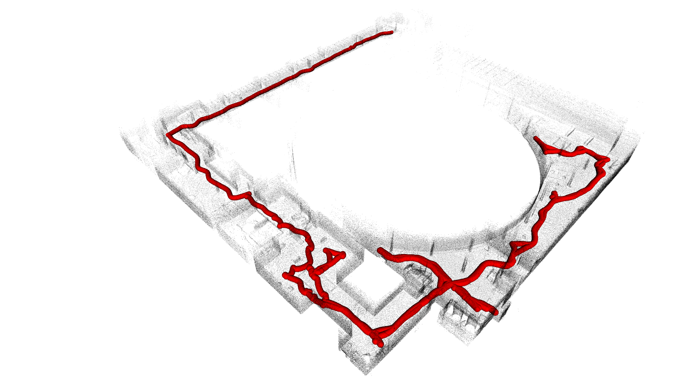
| B  | Satsop Power Plant Elma, WA              |Urban | Spot1  | 664.27   |32:26   |[click](https://nextcloud.robotics.caltech.edu/index.php/s/WyqKoobb2fYnRPK) | 20.1 |[click](https://nextcloud.robotics.caltech.edu/index.php/s/ns6s9yfoNRYLB3E)   |  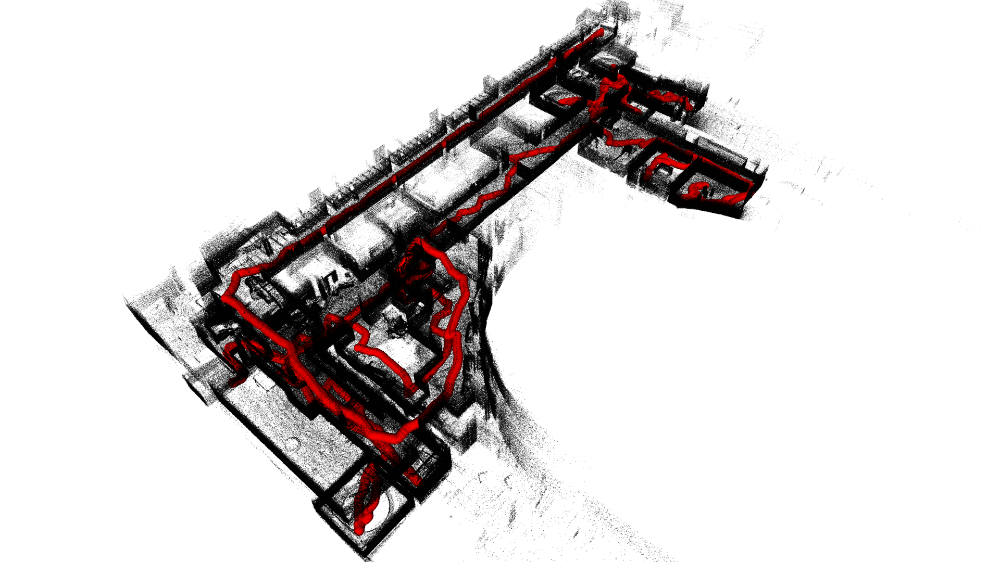
| C  | Satsop Power Plant Elma, WA              |Urban | Husky4 | 757.40   |24:21   |[click](https://nextcloud.robotics.caltech.edu/index.php/s/6QNKyLN85WqN9Rd) |  |[click](https://nextcloud.robotics.caltech.edu/index.php/s/TyoFS93rRo5rgXa)  | 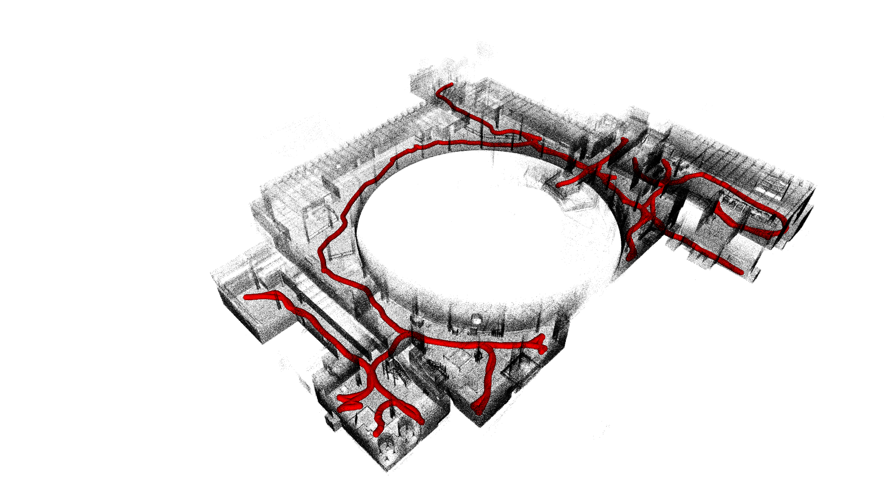
| D  | Bruceton Mine Pittsburgh, PA             |Tunnel| Husky4 | 1795.88  |65:36   |[click](https://nextcloud.robotics.caltech.edu/index.php/s/Rs2W8N28fdZP4jD) |  |[click](https://nextcloud.robotics.caltech.edu/index.php/s/323DQrXF38oE6Cs)   | 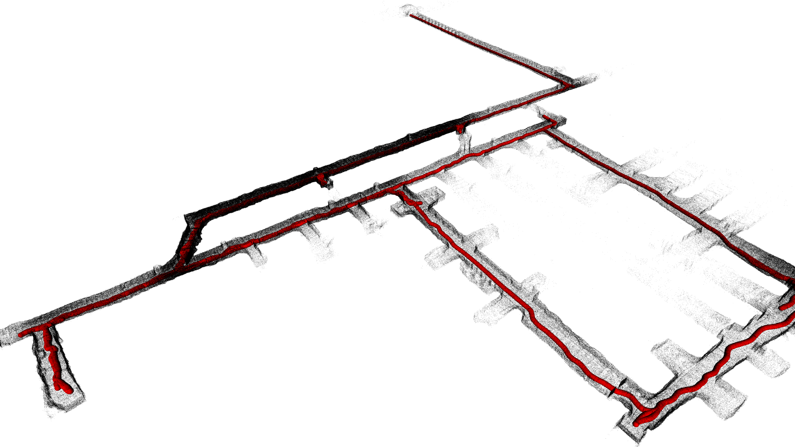
| E  | Lava Beds National Monument, CA          |Cave  | Spot1 | 590.85   |25:20   |[click](https://nextcloud.robotics.caltech.edu/index.php/s/xktmtBgs3eRFMCs) |  |[click](https://nextcloud.robotics.caltech.edu/index.php/s/F7scyfjtWf8te89)   | 
| F  | Bruceton Mine Pittsburgh, PA             |Tunnel| Husky4 | 1569.73  |49:13   |[click](https://nextcloud.robotics.caltech.edu/index.php/s/TLz9DPbgFcB2rN8) |  |[click](https://nextcloud.robotics.caltech.edu/index.php/s/o8cRj8rJg9KNK7A)  | 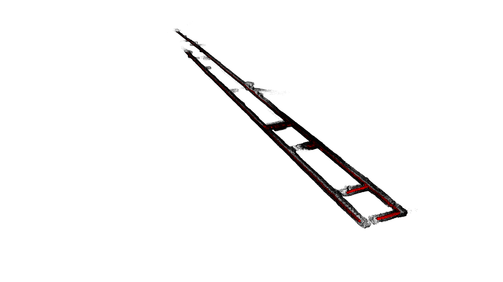
| G  | Satsop Power Plant Elma, WA              |Urban | Husky1 | 877.21   |93:10   |[click](https://nextcloud.robotics.caltech.edu/index.php/s/WxRQ6nWHdCskq2q) |  |[click](https://nextcloud.robotics.caltech.edu/index.php/s/BLJD6DRLiEBByMj)  | 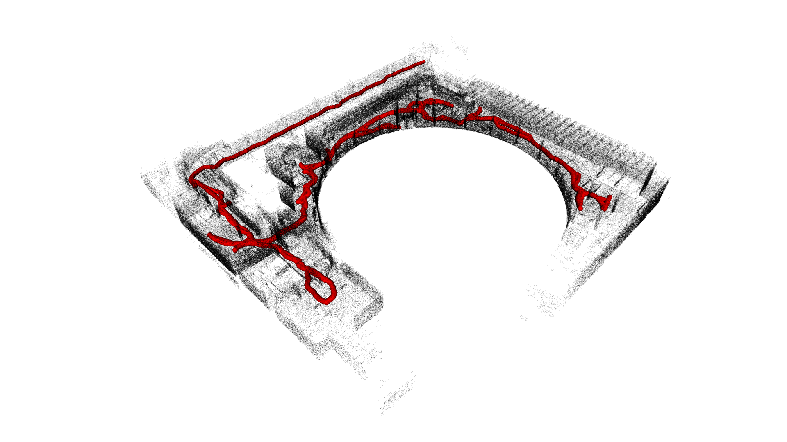
| H  | Subway Station Los Angeles, CA           |Urban | Spot2  | 1777.45  |46:57   |[click](https://nextcloud.robotics.caltech.edu/index.php/s/NPmQCToMXctzmgq) |  |[click](https://nextcloud.robotics.caltech.edu/index.php/s/JrR28wJcM9jMjeE)   | 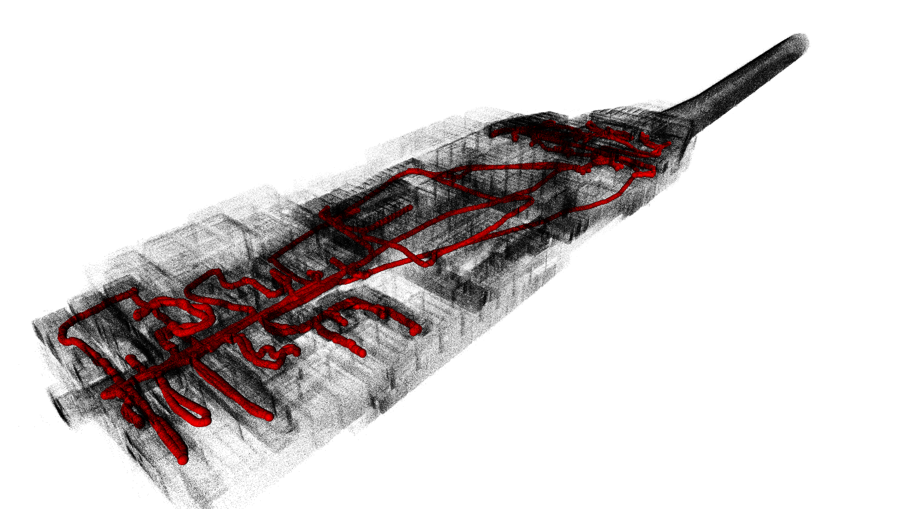
| I  | Kentucky Underground Limestone Mine, KY  |Tunnel| Spot1  | 768.82   |19:28   |[click](https://nextcloud.robotics.caltech.edu/index.php/s/NMiFNccrAbaHFor) |  |[click](https://nextcloud.robotics.caltech.edu/index.php/s/tqCXri5M3HcWYfY)   | 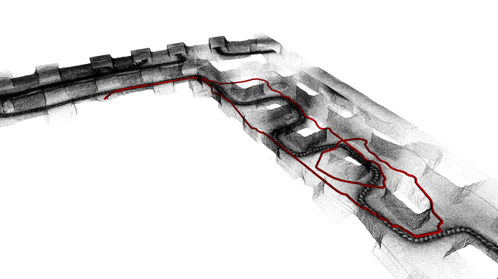
| J  | Kentucky Underground Limestone Mine, KY  |Tunnel| Husky1 | 2339.81  |57:55   |[click](https://nextcloud.robotics.caltech.edu/index.php/s/RrZmws2HyM8gytD) |  |[click](https://nextcloud.robotics.caltech.edu/index.php/s/3zYtj6TGJL58BKx)  | 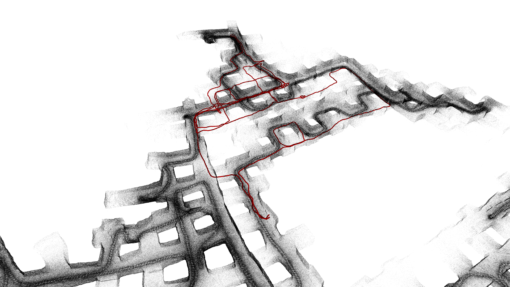
| K  | DARPA Final Louisville Cave, KY          |Mix   | Spot1  | 798.24   |30:56   |[click](https://nextcloud.robotics.caltech.edu/index.php/s/e4kDe3NKYwpgBR4) |  |[click](https://nextcloud.robotics.caltech.edu/index.php/s/8R9jBi69pFCyjXA)   | 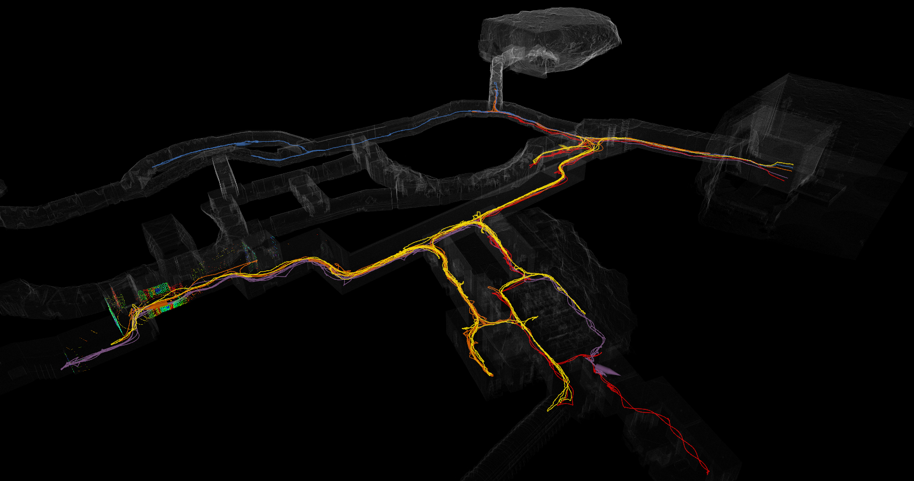
| N  | DARPA Final Louisville Cave, KY          |Mix   | Husky2 | 325.30   |24:08   |[click](https://nextcloud.robotics.caltech.edu/index.php/s/yyR7JkfWcAm9dEj)|   |[click](https://nextcloud.robotics.caltech.edu/index.php/s/8nLdDtztKXqzBi8)   | 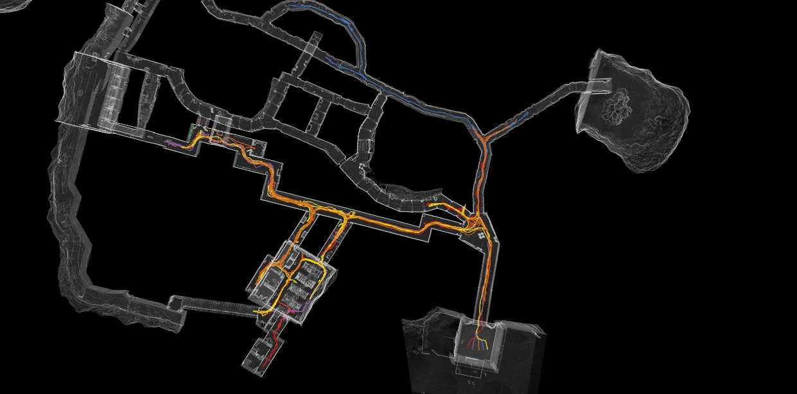
| O  | DARPA Final Louisville Cave, KY          |Mix   | Husky1 | 488.48   |23:48   |[click](https://nextcloud.robotics.caltech.edu/index.php/s/w2Nryc5JXZBy5H8) |  |[click](https://nextcloud.robotics.caltech.edu/index.php/s/2J4wrTL2tCXtT2X)   | 
| P  | DARPA Final Louisville Cave, KY          |Mix   | Spot1  | 571.79   |34:13   |[click](https://nextcloud.robotics.caltech.edu/index.php/s/anLLJdk9XpHc34q) |  |[click](https://nextcloud.robotics.caltech.edu/index.php/s/P4287f8ixbcL2N7)   | 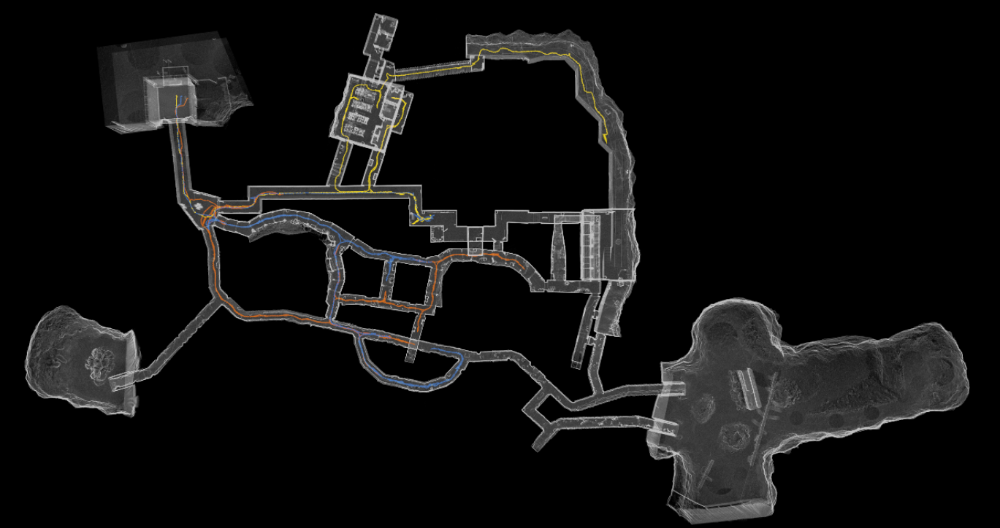

 
# Ground truth

To determine the ground truth of the robot in the environment, a survey-grade $3D$ map (provided by DARPA in the Subterranean Challenge or produced by the team) is used (see Extra files).
The ground-truth trajectory is produced by running [LOCUS](https://github.com/NeBula-Autonomy/LOCUS) against the survey-grade map (i.e., scan-to-map is scan-to-survey-map). In this mode, LOCUS is tuned for maximum accuracy at the cost of computational efficiency, as it does not need to be run in real-time.  
The ground truth is stored in ```odometry.bag``` file. **It's important to remember that the trajectory does not start from (0,0,0)**. The initial position of the robot can be read from the file described [here](#initial-pose)

# Recorded topics

- LiDAR dataset (see [here](/pages/topic_lidar.md))
- Hovermap dataset (see [here](/pages/topic_hovermap.md))

# Extrinsic Calibration
```${robot}_sensors.yaml``` - provides information about relative transformation between sensors (LiDAR-LiDAR, IMU-LiDAR, etc.). The ```parent``` arch refers to the custom-designed device to carry LiDARs sensors.

# Initial Pose

```fiducial_calibration_${robot_name}.yaml``` contains the initial position and orientation (pose) of the robot in the global reference frame according to the 3D map.

# Hovermap dataset

These datasets have a rotating lidar from hovermap. These are not the focus on this dataset release, but are made available for interested researchers. 

|  ID | Place  | Domain  | Robot   | Distance (m) | Duration (min)  | rosbags  | Extra files  | 2D image | 
|:-:|:-:|:-:|:-:|:-:|:-:|:-:|:-:|:-:|
| L  | DARPA Final Louisville Cave, KY          |Mix   | Spot3  | 245.13   |11:41   |[click](https://nextcloud.robotics.caltech.edu/index.php/s/xSebeFcG4EX9LAo)   |[click](https://nextcloud.robotics.caltech.edu/index.php/s/YQzx7kKwjyFtfLo8)  | 
| M  | DARPA Final Louisville Cave, KY          |Mix   | Spot4  | 722.37   |19:57   |[click](https://nextcloud.robotics.caltech.edu/index.php/s/9zfWpSCgSEADDYd)   |[click](https://nextcloud.robotics.caltech.edu/index.php/s/pxNowGgZDGBa5Rs)  | 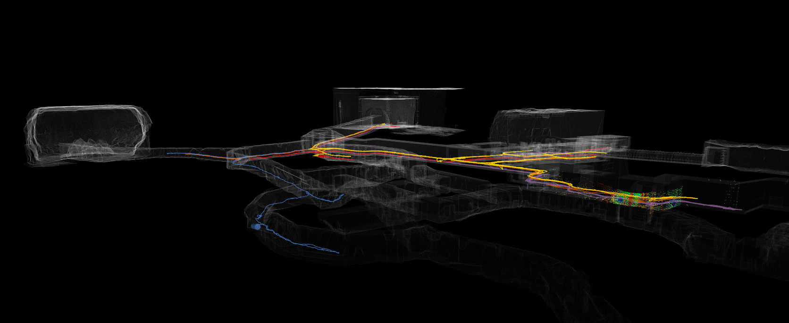
| N  | DARPA Final Louisville Cave, KY          |Mix   | Husky2 | 325.30   |24:08   |[click](https://nextcloud.robotics.caltech.edu/index.php/s/yyR7JkfWcAm9dEj)   |[click](https://nextcloud.robotics.caltech.edu/index.php/s/8nLdDtztKXqzBi8)   | 
| O  | DARPA Final Louisville Cave, KY          |Mix   | Husky1 | 488.48   |23:48   |[click](https://nextcloud.robotics.caltech.edu/index.php/s/w2Nryc5JXZBy5H8)   |[click](https://nextcloud.robotics.caltech.edu/index.php/s/2J4wrTL2tCXtT2X)   | 
| Q  | DARPA Final Louisville Cave, KY          |Mix   | Spot3  | 744.60   |26:55   |[click](https://nextcloud.robotics.caltech.edu/index.php/s/XNN3zwLASGZapBZ)   |[click](https://nextcloud.robotics.caltech.edu/index.php/s/iWq6pBoL7Z57Pww)   | 
| R  | DARPA Final Louisville Cave, KY          |Mix   | Spot4 | 328.42   |13:02   |[click](https://nextcloud.robotics.caltech.edu/index.php/s/Qga9Rtba89pe5zc)   |[click](https://nextcloud.robotics.caltech.edu/index.php/s/sawszAqJ7KZ7Cyj)    | 


