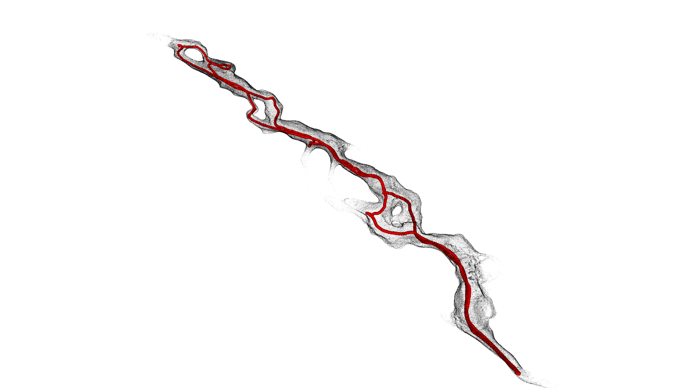
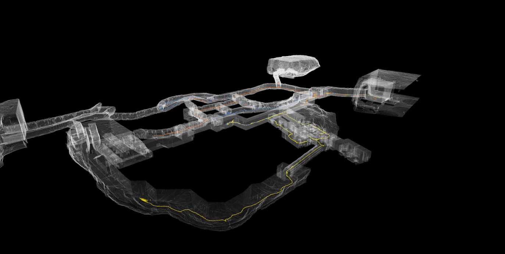

# NOTICE: We are currently having issues with our data storage and are in the process of migrating server. Currently the data is not accessible. We will update this page as soon as the data becomes available. 

<p align="center">

</p>

# Datasets

Here, you can download the datasets. 
- ```Rosbags``` - bag files to run
  - ```${robot_name}_lidar_*.bag``` - LiDAR scans (velodyne packets as well)
  - ```imu.bag``` - imu data from VN100 (covariance also included)
  - ```odometry.bag``` - different types of odometry data (wheeled, kinematic, visual)
- ```Extra files```:
  - ```odometry.bag``` - rosbag file that has a ground truth trajectory
  - ```*.ply```, ```*.pcd``` - 3D map provides information of the scanned 3D map
  - ```fiducial_calibration_${robot_name}$.yaml``` - provides information of inital position in the map (and from where the ground truth starts)
  - ```${robot_name}_sensors.yaml``` - stores information about relative transformation between frames and sensors
- ```2D image``` - provides information of the enviornment from bird's-eye-view

# LiDARs dataset
|  ID | Place  | Domain  | Robot   | Distance (m) | Duration (min)  | rosbags  | Size (GB) | Extra files  | 2D image | 
|:-:|:-:|:-:|:-:|:-:|:-:|:-:|:-:|:-:|:-:|
| A  | Satsop Power Plant Elma, WA              |Urban | Husky4 | 631.53   |59:56   |[click (updated)](https://drive.google.com/drive/folders/1I0YYGzKWB7Hb_Y5PWy9QGRET4TD-NKA_?usp=sharing) | 61.4 |[click (updated)](https://drive.google.com/drive/folders/1BHIwfdGbqFcSipjfTE4ZS9G-iOh0h4Fu?usp=sharing)   | 
| B  | Satsop Power Plant Elma, WA              |Urban | Spot1  | 664.27   |32:26   |[click (updated)](https://drive.google.com/drive/folders/1HFy_LfDCM-Aq8-a08erZ00ztCKisH5IK?usp=sharing)  | 20.1 |[click (updated)](https://drive.google.com/drive/folders/1NUac0zEKcriPA3dgFTzQgF_VDJZhcjoo?usp=sharing)   |  
| C  | Satsop Power Plant Elma, WA              |Urban | Husky4 | 757.40   |24:21   |[click (updated)](https://drive.google.com/drive/folders/1eDZPNEZ0lVx__FoU9RRPcCjSPd-Jlvc1?usp=sharing) | 45.8 |[click (updated)](https://drive.google.com/drive/folders/1g3eac7QCyfdpf5hUObOa41dJLKWyoSmt?usp=sharing)  | 
| D  | Bruceton Mine Pittsburgh, PA             |Tunnel| Husky4 | 1795.88  |65:36   |[click (updated)](https://drive.google.com/drive/folders/1K8q-MpT2yns-gQ_AHLwsgf4qi84yFTHg?usp=sharing) | 31.5 |[click (updated)](https://drive.google.com/drive/folders/1EJCeJ6pmOKWHX94fmCBJiGpJIZ_qUPhg?usp=sharing)   | 
| E  | Lava Beds National Monument, CA          |Cave  | Spot1 | 590.85   |25:20   |[click (updated)](https://drive.google.com/drive/folders/1aGARWd08QeOuPqaG8-llNn0uUpFKYCGl?usp=sharing) | 19.1 |[click (updated)](https://drive.google.com/drive/folders/1-n5By8zMEuV8tjdwPdjIZBtO3L2eVttJ?usp=sharing)   | 
| F  | Bruceton Mine Pittsburgh, PA             |Tunnel| Husky4 | 1569.73  |49:13   |[click (updated)](https://drive.google.com/drive/folders/1I2_LWf5bEFNu6W1Qj_HDCfyo0wL1fG0j?usp=sharing) | 36.8 |[click (updated)](https://drive.google.com/drive/folders/1RH4MvKKJeJNq2-D7x-QtbWMeWl3itl5o?usp=sharing)  | 
| G  | Satsop Power Plant Elma, WA              |Urban | Husky1 | 877.21   |93:10   |[click (updated)](https://drive.google.com/drive/folders/1m2qwRiZrMvUHxJDlQLFfda8WF_CRc5SZ?usp=sharing) | 61.4 |[click (updated)](https://drive.google.com/drive/folders/1eQS07CocMWgFBFXiE5p-GsaLrS7Lkhbg?usp=sharing)  | 
| H  | Subway Station Los Angeles, CA           |Urban | Spot2  | 1777.45  |46:57   |[click (updated)](https://drive.google.com/drive/folders/1d65GMBoaes43Y9GvzjNphCQsdtFkV5kz?usp=sharing) | 16.7 |[click (updated)](https://drive.google.com/drive/folders/15PCmHo8piWrL9-I_-DN0opvDc8C7yf8_?usp=sharing)   | 
| I  | Kentucky Underground Limestone Mine, KY  |Tunnel| Spot1  | 768.82   |19:28   |[click (updated)](https://drive.google.com/drive/folders/1uqn7Y_Gb17DeTGKDdGyyPzQ8NDQd-F74?usp=sharing) | 9.4 |[click (updated)](https://drive.google.com/drive/folders/1jRQh2nYmTNfpFg11LbMUYmLbWb-TDKzB?usp=sharing)   | 
| J  | Kentucky Underground Limestone Mine, KY  |Tunnel| Husky1 | 2339.81  |57:55   |[click (updated)](https://drive.google.com/drive/folders/1z9UNc06GuE_uOoCEU7ni1BWYcS6plPER?usp=sharing) | 79.0 |[click (updated)](https://drive.google.com/drive/folders/1CKx3RrP5DnkKnORpBGOZoXNNg_RFT6ZM?usp=sharing)  | 
| K  | DARPA Final Louisville Cave, KY          |Mix   | Spot1  | 798.24   |30:56   |[click (updated)](https://drive.google.com/drive/folders/1Z_ABh8fiBSh872sfe8UGV3z2mgVoUmby?usp=sharing) | 15.5 |[click (updated)](https://drive.google.com/drive/folders/19kZWXaJ4Z91O0VsJ68wm4d2CMX_vgX-p?usp=sharing)   | 
| N  | DARPA Final Louisville Cave, KY          |Mix   | Husky2 | 325.30   |24:08   |[click](https://nextcloud.robotics.caltech.edu/index.php/s/yyR7JkfWcAm9dEj)|  31.0 |[click (updated)](https://drive.google.com/drive/folders/1J2WNgKlKOwuSEX8aCojiS3339IBR3ClN?usp=sharing)   | 
| O  | DARPA Final Louisville Cave, KY          |Mix   | Husky1 | 488.48   |23:48   |[click](https://nextcloud.robotics.caltech.edu/index.php/s/w2Nryc5JXZBy5H8) | 47.4 |[click (updated)](https://drive.google.com/drive/folders/1QRtmjMUf3uLCbB5B2nMTnuW8SyjSOOcW?usp=sharing)   | 
| P  | DARPA Final Louisville Cave, KY          |Mix   | Spot1  | 571.79   |34:13   |[click (updated)](https://drive.google.com/drive/folders/1y8hWKj_GoXS1rhKq0El9GlNAppTEATt3?usp=sharing) | 12.3 |[click (updated)](https://drive.google.com/drive/folders/1CDif8WGy6PD8WIKTZbkg5M0dckRY_2N8?usp=sharing)   | 

 
# Ground truth

To determine the ground truth of the robot in the environment, a survey-grade $3D$ map (provided by DARPA in the Subterranean Challenge or produced by the team) is used (see Extra files).
The ground-truth trajectory is produced by running [LOCUS](https://github.com/NeBula-Autonomy/LOCUS) against the survey-grade map (i.e., scan-to-map is scan-to-survey-map). In this mode, LOCUS is tuned for maximum accuracy at the cost of computational efficiency, as it does not need to be run in real-time.  
The ground truth is stored in ```odometry.bag``` file. **It's important to remember that the trajectory does not start from (0,0,0)**. The initial position of the robot can be read from the file described [here](#initial-pose)

# Recorded topics

- LiDAR dataset (see [here](/pages/topic_lidar.md))
- Hovermap dataset (see [here](/pages/topic_hovermap.md))

# Extrinsic Calibration
```${robot}_sensors.yaml``` - provides information about relative transformation between sensors (LiDAR-LiDAR, IMU-LiDAR, etc.). The ```parent``` arch refers to the custom-designed device to carry LiDARs sensors.

# Initial Pose

```fiducial_calibration_${robot_name}.yaml``` contains the initial position and orientation (pose) of the robot in the global reference frame according to the 3D map.

# Hovermap dataset

These datasets have a rotating lidar from hovermap. These are not the focus on this dataset release, but are made available for interested researchers. 

|  ID | Place  | Domain  | Robot   | Distance (m) | Duration (min)  | rosbags  | Extra files  | 2D image | 
|:-:|:-:|:-:|:-:|:-:|:-:|:-:|:-:|:-:|
| L  | DARPA Final Louisville Cave, KY          |Mix   | Spot3  | 245.13   |11:41   |[click](https://nextcloud.robotics.caltech.edu/index.php/s/xSebeFcG4EX9LAo)   |[click (updated)](https://drive.google.com/drive/folders/1hO6mnAebFKhwMQ34v5yAbt2iUIIQfJp3?usp=sharing)  | 
| M  | DARPA Final Louisville Cave, KY          |Mix   | Spot4  | 722.37   |19:57   |[click](https://nextcloud.robotics.caltech.edu/index.php/s/9zfWpSCgSEADDYd)   |[click (updated)](https://drive.google.com/drive/folders/1pkRB6k2DC08OwBH2fZ1Gd31E4iixhChW?usp=sharing)  | 
| N  | DARPA Final Louisville Cave, KY          |Mix   | Husky2 | 325.30   |24:08   |[click](https://nextcloud.robotics.caltech.edu/index.php/s/yyR7JkfWcAm9dEj)   |[click (updated)](https://drive.google.com/drive/folders/1ns3O4DagfqB2-Hmc27EZPy38RgJhm-JP?usp=sharing)   | 
| O  | DARPA Final Louisville Cave, KY          |Mix   | Husky1 | 488.48   |23:48   |[click](https://nextcloud.robotics.caltech.edu/index.php/s/w2Nryc5JXZBy5H8)   |[click (updated)](https://drive.google.com/drive/folders/1OhxBRJir-Fx7BPndHWrO9ycEMD_p6S2A?usp=sharing)   | 
| Q  | DARPA Final Louisville Cave, KY          |Mix   | Spot3  | 744.60   |26:55   |[click](https://nextcloud.robotics.caltech.edu/index.php/s/XNN3zwLASGZapBZ)   |[click (updated)](https://drive.google.com/drive/folders/1m1HePXOzFUHWUV36hoB-QliR_k-hnYL0?usp=sharing)   | 
| R  | DARPA Final Louisville Cave, KY          |Mix   | Spot4 | 328.42   |13:02   |[click](https://nextcloud.robotics.caltech.edu/index.php/s/Qga9Rtba89pe5zc)   |[click (updated)](https://drive.google.com/drive/folders/1cqe7yvrMU8bo3aKEMbp_JyNC0ESqCcbu?usp=sharing)    | 


