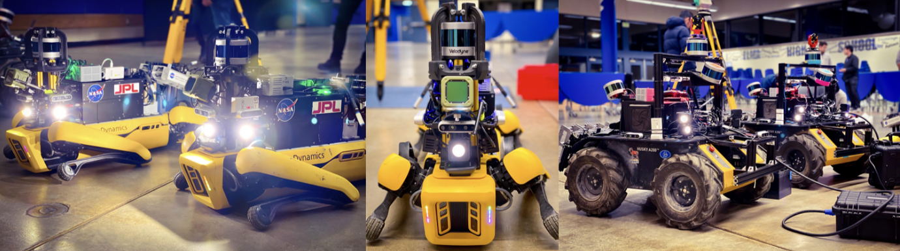
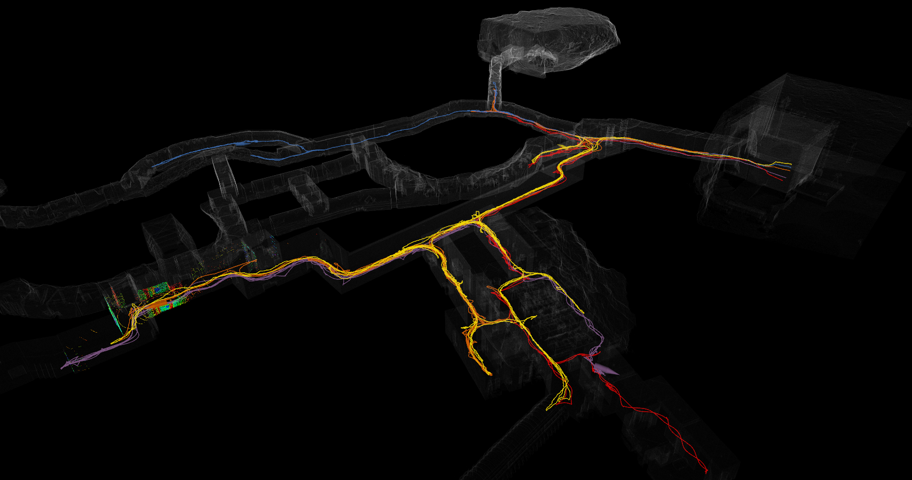

<p align="center">

</p>

# Overview.

The dataset is provided by the [Team CoSTAR](https://costar.jpl.nasa.gov/) that has been intensively testing the multi-robot system in real world environments such as caves, tunnels, abandoned factories and industrial plants for [DARPA Subterranean Challenge](https://www.google.com/search?q=darpa+subt+challenge&oq=darpa+subt&aqs=chrome.1.69i57j35i39j0i512l2j69i60l2j69i65j69i60.2114j0j7&sourceid=chrome&ie=UTF-8)


# Dataset real-world places.

## [Power plant located in Elma, WA](https://www.google.com/maps/place/Satsop+Nuclear+Power+Plant/@46.9616165,-123.472372,16z/data=!4m5!3m4!1s0x0:0x8a108aba7feb7724!8m2!3d46.9616231!4d-123.4675564)


## [Los Angeles Subway Station](https://www.google.com/maps/place/425+S+Hill+St,+Los+Angeles,+CA+90013/@34.0489961,-118.251699,18z/data=!4m8!1m2!2m1!1sSouth+Hill+Street+near+Pershing+Square!3m4!1s0x80c2c64b6a30ca9f:0x1cd85506387e59f5!8m2!3d34.0497312!4d-118.2510744)

 

## [Bruceton Research Mine in Pittsburgh, PA](https://www.google.com/maps/place/Bruceton+Research+Mine/@40.3040108,-79.978597,15z/data=!4m2!3m1!1s0x0:0xa44441e8bb7eb69f?sa=X&ved=2ahUKEwi4vrCP4Yn3AhVumIsKHT19BY4Q_BJ6BAhGEAM)


## [Valentine Cave](https://www.google.com/maps?q=valentine+cave&um=1&ie=UTF-8&sa=X&ved=2ahUKEwjA5ouf4Yn3AhWLuYsKHYgoCzYQ_AUoAnoECAEQBA)

 

## [Kentucky Underground Mine](https://www.google.com/maps?q=Kentucky+Underground&um=1&ie=UTF-8&sa=X&ved=2ahUKEwjMkY_p0ZL3AhWbKkQIHUTRDfkQ_AUoAXoECAEQAw)


## [Louisville Mine, artificially made circuit](https://www.google.com/maps?q=Louisville+Mine&um=1&ie=UTF-8&sa=X&ved=2ahUKEwjFiLa47In3AhXpk4sKHb7pAZIQ_AUoAnoECAEQBA)




Each dataset is selected to contain components that are challenging for LiDAR odometry. The datasets have different duration lengths from 20 min up to 1 h (see [here](dataset.md)). The dataset provides LiDAR scans, [Hovermap scans](https://www.emesent.io/hovermap/), Inertial Measurement Unit (IMU) and wheeled and kinematic inertial odometry (WIO) measurements. All datasets have been recorded on different robotics platforms, e.g., Husky and Spot with vibrations and large, sudden accelerations as is characteristic of both a skid-steer wheeled robot traversing rough terrain (husky) and a legged robot that slips and acts dynamically in rough terrain (spot).
The dataset is synchronized by window time stamp approach where the current time stamp looks for the closest time stamps available with maximum threshold time distance.
LiDAR scans are recorded at 10 Hz. WIO and IMU are recorded at 50~Hz in the Urban datasets, while a higher-rate IMU recording (100 Hz) is available for the Tunnel and Cave dataset.

# Robot Equipment

## Husky


### Equipment
- 3 on-board [Velodyne’s Puck lidar sensor (VLP-16)](https://velodynelidar.com/products/puck/) LiDAR sensors (one flat, one pitched forward ~30 &deg;, one pitched backward ~30 &deg;)  
  - ```velodyne```
  - ```velodyne_front```
  - ```velodyne_rear```
- [IMU VN100](https://www.vectornav.com/products/detail/vn-100?gclid=Cj0KCQjwxtSSBhDYARIsAEn0thQy4ZSoNNRcvUZzJBFEtlZtiIb9PiUJty0BAxZwOUEK2bK6l9XtnLIaAtTnEALw_wcB)
- wheel encoders from Clearpath (see [here](https://clearpathrobotics.com/husky-unmanned-ground-vehicle-robot/))
- [Hovermap](https://www.emesent.io/hovermap/)  (see associated datasets [here](dataset.md))

## Spot
  

### Equipment
- 1 on-board [Velodyne’s Puck lidar sensor (VLP-16)](https://velodynelidar.com/products/puck/) LiDAR sensors 
- Out-of-the-box kinematic-ineratial odometry (KIO) and visual-inertial odometry (VIO) measurements implemented by [Boston Dynamics](https://www.bostondynamics.com/products/spot) 
- [IMU VN100](https://www.vectornav.com/products/detail/vn-100?gclid=Cj0KCQjwxtSSBhDYARIsAEn0thQy4ZSoNNRcvUZzJBFEtlZtiIb9PiUJty0BAxZwOUEK2bK6l9XtnLIaAtTnEALw_wcB)
- [Hovermap](https://www.emesent.io/hovermap/) (see associated datasets [here](dataset.md))
