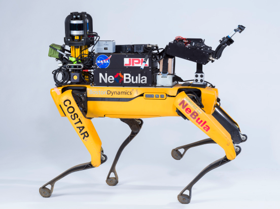

# Hovermap dataset

## Husky
---


- **LiDAR/Hovermap data** (```${robot_name}_lidar_*.bag```)
  - Hovermap topics ```sensor_msgs/PointCloud2``` 
    - ```${robot_name}/hvm/lidar/points```
      - frame_id: ```${robot_name}/hovermap```
  - LiDAR topics (```sensor_msgs/PointCloud2```)
    - ```${robot_name}/velodyne/velodyne_points```
      - frame_id: ```${robot_name}/velodyne```
    - ```${robot_name}/velodyne_front/velodyne_points```
      - frame_id: ```${robot_name}/velodyne_front```
    - ```${robot_name}/velodyne_rear/velodyne_points```
      - frame_id: ```${robot_name}/velodyne_rear```
  - LiDAR packet topics (```velodyne_msgs/VelodyneScan```)
    - ```${robot_name}/velodyne_packets```
      - frame_id: ```${robot_name}/velodyne```
    - ```${robot_name}/velodyne_front/velodyne_packets```
      - frame_id: ```${robot_name}/velodyne_front```
    - ```${robot_name}/velodyne_rear/velodyne_packets```
      - frame_id: ```${robot_name}/velodyne_rear```
  - topics that you should not care about:
    - ```${robot_name}/velodyne_points_min_dist```

- **IMU data** (```imu.bag```)
  - ```${robot_name}/vn100/imu```
    - frame_id: ```${robot_name}/vn100```
  - ```${robot_name}/vn100/imu_wori_wcov```
    - frame_id: ```${robot_name}/vn100```

- **Odometry data** (```odometry.bag```)
  - ```${robot_name}hero/wio_ekf/odom```
    - frame_id: ```${robot_name}/odom``` 
  - ```${robot_name}wheel_odom```
    - frame_id: ```${robot_name}/odom``` 
  - ```${robot_name}/hvm/odometry```
    - frame_id: ```${robot_name}/odom``` 
  - ```${robot_name}/hvm/odometry_transformed```
    - frame_id: ```${robot_name}/odom``` 

## Spot
---
  

- **LiDAR/Hovermap data** (```${robot_name}_lidar_*.bag```)
  - LiDAR topics ```sensor_msgs/PointCloud2``` 
    - ```${robot_name}/velodyne/velodyne_points```
      - frame_id: ```${robot_name}/velodyne```
  - LiDAR packet topics (```velodyne_msgs/VelodyneScan```)
    - ```${robot_name}/velodyne_packets```
  - Spot Realsense Point Cloud (```sensor_msgs/PointCloud2```)
    - ```/${robot_name}/spot_driver/local_grid```
  - topics that you should not care about:
    - ```${robot_name}/velodyne_points_min_dist```

- **IMU data** (```imu.bag```) **(Note: keep in mind that in B, E IMU is not available)**
  - ```${robot_name}/vn100/imu``` 
    - frame_id: ```${robot_name}/vn100```
  - ```${robot_name}/vn100/imu_wori_wcov```
    - frame_id: ```${robot_name}/vn100```

- **Odometry data** (```odometry.bag```)
  - ```${robot_name}/kinematic_odom```
     - frame_id: ```${robot_name}/odom``` 
  - ```${robot_name}/visual_odom```
    - frame_id: ```${robot_name}/odom``` 
  - ```${robot_name}/hvm/odometry```
    - frame_id: ```${robot_name}/odom``` 
  - ```${robot_name}/hvm/odometry_transformed```
    - frame_id: ```${robot_name}/odom``` 
